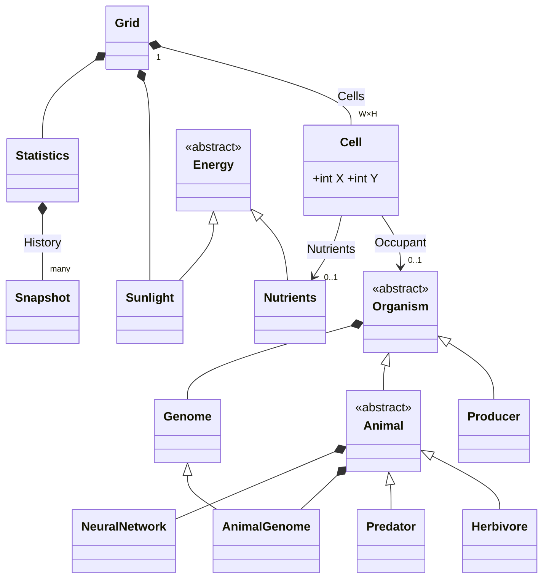

# GameOfLife — programátorská dokumentace

## 1. Přesné zadání (pravidla simulace)

Cílem projektu je vytvořit rozšířenou variantu buněčného automatu Game of Life v jazyce C#. Na rozdíl od původního Conwayova automatu, jehož buňky se řídí pevnými pravidly o dvou stavech, má simulace modelovat zjednodušený ekosystém: mřížku obývají tři trofické úrovně organismů — producenti (rostliny), býložravci a predátoři — které mezi sebou interagují prostřednictvím toku energie. Součástí zadání je požadavek, aby chování živočichů nebylo pevně naprogramované, ale řízené jednoduchou dopřednou neuronovou sítí, jejíž parametry se předávají a proměňují genetickým algoritmem (křížení a gaussovská mutace genomu). Program má dále poskytovat grafické uživatelské rozhraní, které umožní simulaci sledovat v reálném čase, zasahovat do jejích parametrů a pozorovat důsledky těchto zásahů.

Zadání jsem dále upřesnila několika návrhovými rozhodnutími, která určují charakter celé simulace. Základní jednotkou času je jeden simulační krok odpovídající jednomu dni; energie je v celém systému vedena v absolutních hodnotách a její tok podléhá zákonu zachování — energie do ekosystému vstupuje výhradně slunečním zářením, prochází potravním řetězcem a z těl uhynulých organismů se vrací do půdy v podobě živin, které mohou producenti znovu čerpat. Sluneční záření je zároveň hlavním nástrojem uživatele: jeho intenzitu lze měnit za běhu, a představuje tak řízený selekční tlak, jehož dopady na rovnováhu ekosystému lze sledovat v grafech. Zatímco příjem potravy a rozmnožování jsou u organismů reflexivní (řídí se pevnými pravidly a energetickými prahy), pohyb živočichů je plně v rukou neuronové sítě — právě na něm se tedy může projevit evoluce chování.

### 1.1 Prostředí
Simulace se odehrává na pravoúhlé mřížce o rozměrech `Config.GridWidth` × `Config.GridHeight`, ve výchozím nastavení 50 × 50 buněk. Okraje mřížky jsou pevné, takže buňky na okrajích mají méně sousedů a organismy za hranici světa nemohou. Základní stavební jednotkou prostředí je buňka (`Cell`), která funguje jako místo v prostoru (wrapper na gridu) s vlastním obsahem:
Každá buňka zná své souřadnice a může nést nejvýše jednoho obyvatele (`Occupant`) — organismus, který na ní právě stojí. Pravidlo „jedna buňka, jeden organismus" je základním prostorovým omezením celé simulace: vytváří kompetici o místo, která se projevuje například při rozmnožování.
Vedle obyvatele může buňka obsahovat živiny (`Nutrients`) — zásobu energie uvolněnou z těl uhynulých organismů, kterou mohou čerpat producenti. Obyvatel a živiny se navzájem nevylučují; organismus tedy může stát na políčku s živinami.
Energii do celého systému dodává slunce (`Sunlight`). Sluneční záření je záměrně modelováno jako jediná globální hodnota společná pro celou mřížku, v rozsahu 0 až `SunlightMaxEnergy` (výchozí maximum 200). Hodnotu lze měnit za běhu posuvníkem v uživatelském rozhraní: jeho snížením či zvýšením lze vyvolat řízenou poruchu rovnováhy a sledovat její šíření potravním řetězcem.
Čas v simulaci plyne diskrétně po krocích; jeden krok odpovídá jednomu volání metody `Grid.Step()` a koncepčně představuje jeden den. Vše, co se v ekosystému děje — fotosyntéza, pohyb, lov, rozmnožování, stárnutí i rozklad — se odehrává právě uvnitř kroku; mezi kroky je svět neměnný.

### 1.2 Organismy

Všechny organismy sdílejí společného předka — abstraktní třídu `Organism` — a s ním i základní životní veličiny: aktuální zásobu energie (`Energy`) s horním stropem (`EnergyMax`), věk (`Age`) s maximální délkou života (`AgeMax`), práh dospělosti (`AdultAge`), od něhož se organismus smí rozmnožovat, bool `IsAlive` a genom (`Genome`), který jednotlivé veličiny individualizuje a předává potomkům. Energie je univerzální měnou simulace: každá činnost něco stojí, každý zdroj potravy něco vynáší, a organismus, jehož energie klesne na nulu, umírá.
Tři druhy se liší především tím, odkud energii berou a zda a jak se pohybují:

| Druh | Třída | Zdroj energie | Pohyb | Dospělost | Výchozí AgeMax / EnergyMax |
|---|---|---|---|---|---|
| Producent | `Producer : Organism` | slunce + živiny v buňce | ne | 8 kroků | 40 / 1000 |
| Býložravec | `Herbivore : Animal` | producenti (sousední) | ano, NN | 15 kroků | 80 / 2000 |
| Predátor | `Predator : Animal` | býložravci (sousední) | ano, NN | 25 kroků | 150 / 3500 |

Producenti představují rostlinné patro ekosystému: jsou nehybní a energii získávají fotosyntézou ze slunečního záření, případně čerpáním živin z půdy pod sebou. Jsou jediným vstupním bodem energie do potravního řetězce.
Býložravci a predátoři jsou zvířata (odvozená od společné abstraktní třídy `Animal`): živí se pojídáním organismů na sousedních políčkách — býložravci spásají producenty, predátoři loví býložravce — a jejich pohyb po mřížce řídí neuronová síť, takže právě na pohybové strategii se může projevit evoluce chování. 

Počáteční populaci vytváří metoda `Grid.InitializePopulation`. Pro každou buňku mřížky se provede jediný hod generátorem náhodných čísel (`Rng.NextDouble()`), jehož výsledek — číslo mezi 0 a 1 — padne do jednoho z navazujících intervalů daných pravděpodobnostmi `producerChance`, `herbivoreChance` a `predatorChance` (výchozí hodnoty 0,30 / 0,03 / 0,01); zbytek intervalu ponechává buňku prázdnou. Šířka intervalu tak přímo odpovídá očekávanému podílu druhu v populaci. Nově vzniklý organismus začíná s energií na polovině svého `EnergyMax` a s náhodně vygenerovaným genomem — počáteční populace je tedy geneticky rozmanitá.

### 1.3 Energetický model

Veškeré energetické toky v simulaci se řídí konstantami definovanými ve třídě `Config`. Čtyři z nich — `StepEnergyCost`, `MovementEnergyCost`, `ReproductionEnergyCost` a `PredationEfficiency` — mají navíc za běhu měnitelnou kopii ve statické třídě `RuntimeSettings`, takže je lze ladit z uživatelského rozhraní bez restartu aplikace; `Config` v takovém případě slouží jako neměnná sada výchozích hodnot, k nimž se lze kdykoli vrátit.
Většina nákladů a prahů je definována relativně k `EnergyMax` daného organismu, nikoli absolutním číslem. Díky tomu zůstávají pravidla „spravedlivá" napříč druhy s řádově odlišnými energetickými stropy — bazální metabolismus stojí producenta i predátora stejný zlomek jeho maxima — a zároveň se automaticky přizpůsobují, když evoluce hodnotu `EnergyMax` v genomu posune.
Následující tabulka shrnuje všechny energetické děje jednoho simulačního kroku:

| Děj | Vzorec | Výchozí hodnota |
|---|---|---|
| Bazální metabolismus (každý krok, všichni) | `−EnergyMax × StepEnergyCost` | 0,0001 → 0,1 z 1000 |
| Fotosyntéza (producent, každý krok) | `+PhotosynthesisEfficiency × Sunlight` | 0,4 × 200 = 80 |
| Vstřebání živin (producent) | `+min(Nutrients, EnergyMax × NutrientAbsorbtionRate)` | až 20 % `EnergyMax` |
| Pohyb (zvíře, jen když se skutečně pohne) | `−EnergyMax × MovementEnergyCost` | 0,0002 |
| Sežrání kořisti | `+prey.Energy × PredationEfficiency` | 0,3 |
| Rozmnožení — podmínka | `Energy ≥ 0,8 × EnergyMax` (zvířata navíc `Age ≥ AdultAge` a partner se stejnou podmínkou) | |
| Rozmnožení — cena | `−EnergyMax × ReproductionEnergyCost` (u zvířat platí oba rodiče) | 0,3 |
| Novorozenec | `NewbornEnergyFraction × EnergyMax rodiče` | 0,3 |
| Smrt → živiny | `Nutrients = Energy × DecompositionFraction` | 0,3 |
| Rozklad živin (každý krok) | `× NutrientDecayFactor`; pod `NutrientMinEnergy` (1,0) zmizí | 0,95 |
| Horní mez energie | `Energy` se ořízne na `EnergyMax` | |
| Smrt | `Energy ≤ 0` nebo `Age > AgeMax` | |

Z výchozích hodnot plyne několik důsledků, které je užitečné znát při navrhování experimentů:

Producenti žijí v hojnosti. Ze startovní energie 500 se producent při plném slunci naplní za zhruba šest kroků a poté se rozmnožuje prakticky každý druhý krok, dokud má v okolí volné místo; metabolický náklad 0,1 energie za krok je proti fotosyntetickému zisku 80 zanedbatelný. Populaci producentů tedy nelimituje energie, ale výhradně prostor a maximální věk.
Také bazální a pohybové náklady zvířat jsou velmi nízké (dohromady 0,6 energie za krok při stropu 2000). Zvířata proto zpravidla neumírají postupným vyčerpáním, ale stářím — nebo naopak tím, že se k potravě nedostanou vůbec.
Slunce představuje každý krok externí vstup; predace a rozklad pracují s účinností 0,3 (zbytek energie se „ztrácí", což abstrahuje neúplnost trávení a činnost rozkladačů) a živiny se navíc rozpadají tempem 5 % za krok. Veličina `Statistics.TotalEnergy` (součet energie organismů a živin) je proto ukazatelem okamžitého stavu ekosystému, nikoli invariantem — její růst znamená, že přítok ze slunce převažuje nad ztrátami, a naopak.

### 1.4 Nutrient cyklus
Živiny uzavírají energetický okruh simulace: energie uhynulých organismů se nevytrácí okamžitě, ale vrací se do půdy, odkud ji mohou zpětně čerpat producenti. Celý cyklus má čtyři fáze:

1. Vznik
Když `Grid.Step()` narazí na buňku, jejíž obyvatel již nežije (`Occupant.IsAlive == false`), odstraní tělo z mřížky a na jeho místě založí zásobu živin o velikosti `Energy` × `DecompositionFraction`, tedy 30 % energie, kterou organismus měl v okamžiku smrti.

2. Rozklad 
Každá zásoba živin se každý krok zmenšuje voláním `Nutrients.Decay()` na 95 % předchozí hodnoty; jakmile klesne pod práh `NutrientMinEnergy` (1,0), objekt se z buňky odstraní. Živiny jsou tedy dočasný zdroj — velká mrtvola vydrží desítky kroků, drobné zbytky mizí rychle.

3. Čerpání 
Producent stojící v buňce s živinami je průběžně vstřebává metodou `Drain()`, nejvýše však 20 % svého `EnergyMax` za krok. Živiny se nešíří do okolních buněk; využít je může pouze producent, který v dané buňce vyroste — typicky potomek umístěný do ní při rozmnožování. Recyklace je tak vázána na místo úmrtí, což v mřížce vytváří viditelné „úrodné" stopy po vlnách umírání.


### 1.5 Vnímání, neuronová síť a genom

Chování zvířat vzniká spojením tří mechanismů: vnímání okolí převádí stav mřížky na čísla, neuronová síť z těchto čísel vypočítá rozhodnutí o pohybu, a genom určuje jak parametry těla, tak váhy sítě — a tím vším prochází dědičnost a mutace, které umožňují evoluci.

1) Vnímání 
Metoda `Animal.ScanSurroundings` snímá čtvercové okno kolem zvířete dané poloměrem `ScanningRadius = 4`, tedy okno 9 × 9 buněk bez středového políčka, oříznuté případným okrajem mřížky. Aby měl výstup pevnou velikost nezávislou na počtu objektů v okolí, dělí se okno do osmi směrových sektorů přibližně po 45° a funkce `ScanByDirection` v každém sektoru vyhledá pouze nejbližší relevantní objekt daného typu. Zvíře tedy nevidí jednotlivé buňky, ale odpovědi na otázku „co nejbližšího je tímhle směrem". Tato forma komprese drží počet vstupů sítě malý a stálý. Vstupy neuronové sítě: Metoda `BuildNeuralInputs` z výsledků skenování sestavuje vektor 33 hodnot:

| Index | Význam | Hodnoty |
|---|---|---|
| 0–15 | potrava: pro každý směr `(1 − vzdálenost/4, energie kořisti)` | blízkost 0–1; energie potravy |
| 16–23 | hrozba: vzdálenost nejbližšího predátora v každém směru | 0–1; u predátorů vždy 0 (`MatchesThreat => false`) |
| 24–31 | partner: vzdálenost nejbližšího dospělého partnera s energií ≥ 80 % | 0–1 |
| 32 | vlastní `Energy / EnergyMax` | 0–1 |

Vzdálenosti jsou převedeny na „blízkost" (1 = hned vedle, 0 = mimo dosah), takže silnější signál znamená bližší objekt. Potrava nese v každém směru dvojici hodnot — blízkost i energii kořisti — a síť tak v principu může vážit, zda se vyplatí jít dál za vydatnějším soustem. Poslední vstup dává zvířeti informaci o vlastním hladu; právě ten umožňuje, aby se stejná síť chovala jinak najedená a jinak hladová.

2) Síť 
`NeuralNetwork.Forward` je dopředná síť o dvou vrstvách 33 → 16 → 8 s aktivační funkcí tanh v obou vrstvách a bez biasů. Všech 656 vah (33·16 + 16·8) je uloženo v jediném poli `double[]` za sebou: prvek `weights[j·33 + i]` je váha mezi vstupem `i` a skrytým neuronem `j`, od indexu 528 následují váhy výstupní vrstvy `weights[528 + k·16 + l]`. Výstupem je osm hodnot — po jedné pro každý směr — a o pohybu rozhodne argmax, tedy směr s nejvyšší aktivací. Síť je čistě statická funkce bez vnitřního stavu: nemá paměť, neučí se za života jedince; jediný způsob, jak se „učí", je evoluce vah napříč generacemi.

3) Genom 
Dědičnou informaci nese třída `Genome` a její rozšíření `AnimalGenome`:
Pole `Genes[]` je indexované výčtem `GeneIndex` a obsahuje `AgeMax`, `EnergyMax` a `StepEnergyCost`; zvířecí genom přidává `MovementEnergyCost` a především pole `Weights[656]` s vahami neuronové sítě, které se dědí a mutují stejně jako ostatní geny. Producent má tedy 3 geny, zvíře 4 + 656 vah.
Počáteční genom vzniká gaussovským rozptylem kolem výchozích hodnot se směrodatnou odchylkou `MutationSigma = 0,05` a ořezem do druhových mezí `<Druh>Min/Max<Gen>`; váhy sítě se losují přibližně z rozdělení N(0; 0,5).
Producenti se rozmnožují nepohlavně (`Genome.Mutate`): potomek vzniká z jediného rodiče a každý jeho gen je rodičovská hodnota posunutá gaussovskou mutací, oříznutá funkcí `Math.Clamp` do povolených mezí.
Zvířata se rozmnožují pohlavně (`AnimalGenome.Crossover`): každý gen i každá váha potomka je průměrem hodnot obou rodičů, k němuž se přičte gaussovský šum se `σ = MutationSigma`; geny se ořezávají do druhových mezí, váhy do intervalu `±WeightBound (= 2)`.
Gaussovská náhodná čísla se generují Box–Mullerovou transformací (převod rovnoměrného rozdělení na normální) nad sdíleným generátorem Grid.Rng, takže i mutace podléhají determinismu seedu.
Poznámka k síle mutace: σ je absolutní hodnota v jednotkách genu. Pro váhy sítě (rozsah ±2) představuje σ = 0,05 smysluplnou variabilitu, avšak pro `AgeMax` (desítky) a zejména `EnergyMax` (tisíce) je prakticky nulová — reálná evoluce proto v současné verzi probíhá téměř výhradně ve vahách neuronové sítě, tedy v chování, nikoli ve stavbě těla. Nabízí se budoucí rozšíření: relativní σ na gen, případně widget pro její ladění za běhu.

### 1.6 Determinismus a náhoda
Jediným zdrojem náhody v simulačním jádře je statický generátor `Grid.Rng`. Uživatel může před inicializací zadat vlastní seed; dvě spuštění se stejným seedem a stejnými parametry pak proběhnou zcela identicky, krok po kroku, což je základem reprodukovatelných experimentů.
Výjimkou jsou presety `Náhodný poměr` a `Náhodné životní parametry`: ty používají vlastní, neseedovaný Random, a jejich výsledek se proto do determinismu seedu nepromítá.
`Grid.Rng` i `RuntimeSettings` jsou statické, a na Blazor Serveru tudíž sdílené mezi všemi připojenými prohlížeči. Pro zamýšlené použití jedním uživatelem to nehraje roli; při více současných relacích by se však relace navzájem ovlivňovaly (změna parametru v jednom okně platí i ve druhém).

## 2. Zvolený algoritmus — krok simulace

Jádrem simulace je metoda `Grid.Step()`, která provede jeden časový krok světa. Jde o prostý sekvenční průchod mřížkou v pevném pořadí souřadnic. Asymptotická složitost kroku je `O(W·H·r²)`, kde r je poloměr vnímání zvířat: pro každou buňku se v nejhorším případě skenuje okno `(2r+1)²` okolních buněk. Při výchozích hodnotách (mřížka 50 × 50, r = 4) to znamená řádově stovky tisíc elementárních operací na krok, simulace však běží plynule i pro rychlost 15 kroků za sekundu.
Průchod pro každou buňku vykoná čtyři úlohy v pevném pořadí — úklid mrtvých, akci obyvatele, umístění případného potomka a rozklad živin:

```
pro x = 0..W-1, pro y = 0..H-1:   (x vnější, y vnitřní)
    occupant = Cells[x,y].Occupant
    pokud occupant ≠ null a occupant není naživu:
        Cells[x,y].Nutrients += occupant.Energy × 0,3
        Occupant = null
        pokračuj 
    pokud occupant je Animal:      
        potomek = occupant.Act(grid, x, y)
        // Act vrací potomka nebo null, nedojde-li k reprodukci
    pokud occupant je Producer:    
        potomek = occupant.Act(grid, x, y)
    pokud potomek ≠ null:   
        umísti do první volné buňky v okolí 5×5 rodiče
    pokud v buňce jsou živiny: 
        Decay()
        pod 1,0 odstraň
StepNumber++
Statistics.RecordStep()
```

Chování jednotlivých organismů je soustředěno do metody `Act`, kterou krok volá pro každého živého obyvatele. U zvířat má podobu pevné posloupnosti priorit — nejprve tělo, pak reflexy, nakonec rozhodnutí sítě:
```
Metabolize()                              – náklady + stárnutí (může zabít)
observations = ScanSurroundings(r = 4)
pokud je potrava hned vedle
    Eat(tu s nejvyšší energií)
    ate = true
pokud je dospělý & Energy ≥ 80 % & partner vedle (dospělý, ≥ 80 %)
    Reproduce(partner)
pokud !ate
    Move(): NN → argmax → pokus o přesun
    při obsazené/cizí cílové buňce zůstane stát bez nákladů
```

Jedení a rozmnožování jsou reflexy — nastanou-li podmínky, proběhnou vždy, bez účasti neuronové sítě. Síť rozhoduje výhradně o pohybu, a to jen tehdy, když zvíře v daném kroku nejedlo. Evoluce tedy nemůže „vypnout" pud sebezáchovy ani rozmnožování; optimalizovat může pouze to, kudy se zvíře světem pohybuje — tedy jak často se do situací umožňujících reflexy dostane.

Producent je nejjednodušší: `Metabolize()` → `Photosynthesize(Sunlight)` → `AbsorbNutrients(vlastní buňka)` → a při energii nad 80 % maxima `Reproduce()`.

Sekvenční průchod přináší několik artefaktů, které jsou vědomě přijatým zjednodušením a které je při interpretaci simulace třeba znát:

- Zvíře, které se přesune do buňky s vyšším indexem (větší x, nebo stejné x a větší y), průchod v témže kroku navštíví znovu — a zvíře tedy jedná podruhé. Totéž se týká čerstvě umístěných potomků: potomek položený „před" pozici průchodu jedná poprvé až v příštím kroku, potomek položený „za" ni ještě v tomtéž. Pohyb po směru průchodu je tím nepatrně zvýhodněn.

- Sežraná kořist je v okamžiku ulovení pouze označena (`IsAlive = false`); z mřížky ji odstraní až úklidová fáze při návštěvě její buňky — v tomtéž kroku, leží-li ve směru průchodu před predátorem, jinak až v kroku následujícím. Do té doby mrtvé tělo blokuje buňku a je započítáno ve Statistics i vykresleno v GUI; okamžité počty tedy mohou o jednotky nadhodnocovat živou populaci.

- Soupeří-li dvě zvířata o tutéž kořist, vyhrává to s nižším indexem buňky — pořadí průchodu funguje jako tichá priorita. V dlouhodobých statistikách je tento efekt zanedbatelný.

## 3. Diskuse návrhových rozhodnutí

Následující body shrnují hlavní návrhová rozhodnutí, zvažované alternativy a důvody volby.
- *Reflexy + neuronová síť pouze pro pohyb*
    Příjem potravy a rozmnožování jsou pevná pravidla; síť rozhoduje výhradně o směru pohybu. Zvažovanou alternativou byla síť s bohatším výstupem — kromě osmi směrů i akce „jíst" a „rozmnožit se", případně „stát". Zvolená varianta má tři výhody: výstup sítě zůstává malý a jednoznačně interpretovatelný (argmax z osmi směrů), evoluce řeší jediný, dobře definovaný problém (kam jít). Cenou je, že evoluce nemůže objevit strategie založené na odkládání reflexů (například nechat kořist dorůst).

- *Průměrování s šumem místo klasického křížení po genech*
    Pohlavní rozmnožování zvířat kombinuje genomy průměrem rodičovských hodnot s přičteným gaussovským šumem, nikoli klasickým crossoverem (výběr celých genů střídavě od rodičů). Průměrování je implementačně triviální, u vah neuronové sítě dává hladké přechody mezi rodičovskými strategiemi a nevytváří nekonzistentní kombinace vah, které by u crossoveru mohly vznikat rozstřižením spolupracujících skupin neuronů. Nevýhodou je tendence populace konvergovat ke střední hodnotě a ztrácet diverzitu; tu v modelu udržuje výhradně mutační šum.

- *Sekvenční průchod místo dvoufázového kroku (plán → aplikace)*
    Klasická řešení buněčných automatů počítají nový stav do oddělené kopie mřížky, aby akce v rámci kroku byly simultánní. Zvolený jednofázový průchod je jednodušší, nevyžaduje kopii světa ani řešení konfliktů (dvě zvířata plánující přesun na totéž pole). "Nespravedlivé" situace jsou zde však v úhrnu statisticky zanedbatelné a hlavně deterministické, takže neohrožují reprodukovatelnost experimentů. Dvoufázová varianta by navíc vyžadovala definovat řešení kolizí, což je vlastní netriviální rozhodovací problém; jednofázový průchod jej řeší implicitně pořadím.

- *Globální slunce místo lokálního světla*
    Sluneční energie je jediná hodnota pro celou mřížku. Alternativou bylo lokální osvětlení (gradienty, stíny vrhané organismy, denní putování světla mřížkou), které by vytvářelo bohatší prostorovou dynamiku — ale také by znesnadnilo interpretaci experimentů. Jedna globální hodnota se přirozeně ovládá posuvníkem, umožňuje čisté experimenty typu „zatmění" (skokové ztlumení a sledování kaskády potravním řetězcem); denní cyklus lze doplnit jako časovou modulaci globální hodnoty, aniž by se model musel měnit.

- *Mřížka s pevnými okraji*
    Svět se na okrajích nezavíjí; buňky u kraje mají méně sousedů a vznikají oblasti, kde je méně potravy i únikových cest. Takzvaná "toroidní topologie" (běžná u Game of Life) by okrajové efekty odstranila, ale za cenu méně intuitivní geometrie pro pozorovatele — na obrazovce sousedí levý a pravý okraj, což čtení mřížky komplikuje. 

- *Osm směrových sektorů místo úplného vnímání okna*
    Zvíře nevnímá obsah všech ~80 buněk okna, ale jen nejbližší objekt v osmi směrech. Úplné vnímání by znamenalo stovky vstupů sítě (a řádově více vah k evoluci); sektorová komprese drží síť malou (33 vstupů, 656 vah). Cenou je hrubost vjemu: zvíře nerozliší dva objekty za sebou v témže směru.

- *Dopředná síť bez paměti místo rekurentní*
    Síť nemá vnitřní stav; zvíře reaguje vždy jen na okamžitý vjem. Možným řešením by byla rekurentní varianta (paměť posledních kroků), která by umožnila strategie typu systematické prohledávání, ale násobně by zvětšila genom a ztížila interpretaci chování.

## 4. Program — struktura

### 4.1 Rozdělení
Kód je rozdělen do dvou vrstev s jednosměrnou závislostí. Simulační jádro (12 souborů, složka `Components/Simulation`) je čisté C# bez jakékoli vazby na Blazor — beze změny použitelné třeba z konzolové aplikace nebo testovacího skriptu. Grafické rozhraní (4 komponenty Razor + přidružené CSS, složka Components/Pages) stojí nad ním: drží jedinou instanci třídy `Grid`, v časovači na ní volá `Step()` a výsledný stav vykresluje. Veškerá komunikace tedy teče jedním směrem — GUI čte a řídí simulaci, simulace o GUI neví. Toto oddělení se v průběhu vývoje opakovaně vyplatilo: rozsáhlé přestavby rozhraní (layout, grafy, ovládací prvky) neměnily jediný řádek jádra a naopak.

Několik záměrných zjednodušení vzhledem k rozsahu projektu: všechny typy žijí v globálním namespace, projekt nemá žádné externí knihovny — populační graf je ručně generované SVG z Razor šablony, nikoli grafovací komponenta třetí strany, a globální parametry drží dvě statické třídy: `Config` obsahuje neměnné výchozí hodnoty všech konstant, `RuntimeSettings` jejich za běhu laditelné kopie pro čtveřici experimentálních parametrů.

Diagram níže zachycuje simulační model; GUI vrstva je popsána v kapitole 5. 




### 4.2 Třídy jádra

Následující tabulka je referenčním přehledem všech tříd simulačního jádra — jejich odpovědností a klíčových členů. Detailní chování je popsáno v kapitolách 1 a 2; zde jde o rychlou orientaci v tom, kde co hledat.

| Třída | Odpovědnost | Klíčové členy |
|---|---|---|
| `Config` | všechny konstanty (rozměry, energetika, meze genů, rozměry NN, graf) | `const`; jen nutrient parametry jsou `static` ( v přípravě na modifikaci uživatelem - zatím neimlementováno) |
| `RuntimeSettings` | za běhu měnitelné kopie 4 energetických konstant | statické property |
| `Energy` (abstr.) → `Nutrients`, `Sunlight` | nosič energie; živiny umí `Drain`, `Decay`, `IsDepleted`; slunce `UpdateEnergy` s ořezem 0–200 | |
| `Cell` | `Occupant`, `Nutrients`, `X`, `Y` | |
| `Grid` | mřížka, průchod kroku, přesuny, umístění potomků, inicializace populace; drží `Sunlight`, `Statistics` a statický `Rng` | `Step()`, `MoveOrganism()`, `PlaceOffspring()`, `InitializePopulation()`; `PrintStatus()` je ladicí výpis do konzole |
| `Organism` (abstr.) | energie, věk, smrt, metabolismus | `UpdateEnergy()` (ořez shora, smrt při ≤ 0), `UpdateAge()`, `Metabolize()`, `Die()` |
| `Animal : Organism` (abstr.) | vnímání, NN vstupy, pohyb, obecná logika kroku; typované pomocné metody `FindAdjacentFoodType<T>`, `FindAdjacentMateType<T>`, `FindMates<T>` | `Act()`, `Move()`, `ScanSurroundings()`, `ScanByDirection()`, `BuildNeuralInputs()`; vnořené `ObservedCell`, `DirectionalInfo`, `Direction`, `DirectionCoords` |
| `Producer` | fotosyntéza, vstřebávání živin, nepohlavní rozmnožení | `Act()`, `Photosynthesize()`, `AbsorbNutrients()`, `Reproduce()` |
| `Herbivore`, `Predator` | konkretizace `Animal`: co je potrava / hrozba / partner, `Eat`, `Reproduce` s `Crossover` | `Predator`|
| `Genome`, `AnimalGenome` | geny, náhodné genomy, `Mutate` (producent), `Crossover` (zvířata), `GaussianRNG` | `GeneIndex` enum |
| `NeuralNetwork` | statický `Forward()` | |
| `Statistics` | `record Snapshot` a `History` — po každém kroku počty, součty energií po druzích, celková energie (vč. živin), intenzita slunce 0–1 | `RecordStep()` |

Za pozornost stojí několik strukturálních detailů:
Hierarchie organismů má dvě abstraktní patra: `Organism` nese to, co je společné všemu živému (energie, věk, metabolismus, smrt), `Animal` přidává vše, co odlišuje pohyblivé druhy — vnímání, stavbu vstupů sítě a pohyb. Konkrétní druhy (`Producer`, `Herbivore`, `Predator`) pak dodávají už jen svá specifika: zdroj potravy, definici hrozby a partnera, způsob rozmnožení.
Generické pomocné metody `FindAdjacentFoodType<T>` a příbuzné umožňují, aby `Herbivore` a `Predator` sdílely tutéž vyhledávací logiku a lišily se pouze dosazeným typem (`Producer`, resp. `Herbivore`) — druhová odlišnost je tak vyjádřena typovým parametrem, nikoli kopií kódu.
`Statistics` je jediná třída jádra, která simulaci pouze pozoruje: sbírá po každém kroku snímek (`record Snapshot`) do historie, ale do běhu nezasahuje. GUI z ní čte data pro graf; jádro by běželo stejně i bez ní.

### 4.3 Datové struktury
Volba datových struktur se odvíjí od toho, že veškeré informace o světě jsou uložené na Gridu:
Mřížka je dvourozměrné pole `Cell[,]` indexované `[x, y]`. Organismy nemají žádný vlastní globální seznam — existují výhradně jako `Occupant` své buňky. Organismus tedy svou polohu nezná a souřadnice se mu předávají jako parametry volání `Act(grid, x, y)`. Výhodou je nemožnost nekonzistence (poloha nemůže být uložena na dvou místech rozdílně), cenou je, že každá operace s okolím jde přes mřížku.
Vnímání pracuje se dvěma pomocnými strukturami: sken okna vrací `List<ObservedCell>` (relativní posun Dx, Dy a obyvatel), z něhož se sestaví `Dictionary<Direction, DirectionalInfo> `— pro každý z osmi směrů nejbližší nalezený kandidát.
Genom je pole `double[] Genes`; zvířecí genom přidává `double[] Weights` o 656 prvcích s vahami neuronové sítě.
Statistika je `List<Snapshot>`, který po celý běh neomezeně roste — historie se neořezává. Při typických délkách běhů (tisíce kroků, desítky bajtů na snímek) je paměťová náročnost zanedbatelná; limit by se projevil až u řádově milionů kroků.

### 4.4 Tok dat mezi simulací a GUI (`SimulationPage.razor`)
Stránka `SimulationPage` s @rendermode `InteractiveServer` je jediným místem, kde se obě vrstvy potkávají; následující body popisují všechny kanály, kterými data tečou
- `@rendermode InteractiveServer`; stránka běží v režimu `InteractiveServer`: instance komponenty žije na serveru po celou dobu spojení s prohlížečem a simulace (`Grid`) je jejím privátním polem — svět tedy existuje výhradně v paměti serveru; obnovení stránky znamená nový svět.
- Běh: `Start()` vytvoří `PeriodicTimer(1000 / stepsPerSec ms)` a ve smyčce `await WaitForNextTickAsync()` → `lock (safetyLock) { grid.Step(); }` → `InvokeAsync(StateHasChanged)`. `Stop()` timer `Dispose()`ne, čímž smyčka skončí. Změna rychlosti timer restartuje.
- Všechny zásahy z GUI (krok, reset, slunce, změna `RuntimeSettings`) jsou pod stejným `safetyLock`, takže UI nikdy nečte rozpracovaný stav.
- `Reset()`: `Stop()` → `Grid.Rng = new Random(seed)` → `OnInitialized()` (nový `Grid` + `InitializePopulation` s aktuálními pravděpodobnostmi).
- Graf: komponenta `Chart` dostává `History` a přepínače, generuje `<polyline>` v SVG 500×300 (`Config.GraphWidth/Height`). Počty sdílejí jedno měřítko (max ze všech tří druhů), energie jiné (max `TotalEnergy`), slunce 0–1; je zde možnost přepnout grafy z lineární na logaritmickou škálu.
- `Fullscreen` volá JS funkci `toggleFullscreen` (definovaná v `App.razor`).

### 5. Vrstva GUI

Uživatelské rozhraní je postaveno na technologii Blazor Server: stránka běží jako komponenta na serveru, prohlížeč slouží pouze jako zobrazovací plocha připojená websocketem (SignalR) a po každé změně stavu se do něj posílají jen rozdíly ve vykresleném HTML.

## 5.1 Komponenty
`SimulationPage.razor` je hlavní stránka aplikace. Vlastní instanci simulace (`Grid`), veškerý stav rozhraní (běží/stojí, rychlost, zvolená škála grafu, viditelnost křivek, vybraná buňka, hodnoty inicializačních polí) a všechny obslužné metody. Ostatní komponenty jsou na `SimulationPage` závislé: data dostávají skrze parametry a změny hlásí zpět přes callbacky, samy na simulaci nesahají.
`Chart.razor` vykresluje populační graf. Dostává historii snímků (`List<Statistics.Snapshot>`); z dat generuje SVG křivky (`<polyline>`), přičemž souřadnice bodů počítá jediná parametrizovaná metoda `Points` — výběr veličiny ze snímku se předává jako funkce (`Func<Snapshot, double>`), takže přidání křivky nevyžaduje duplikaci výpočtu.
`App.razor` a `Routes.razor` tvoří minimální kostru aplikace (HTML obálka, router); výchozí layout šablony byl odstraněn, stránka zabírá celou obrazovku.

## 5.2 Rozvržení a vykreslení mřížky 
Stránka je rozdělena CSS (Cascading Style Sheets) gridem na dva sloupce: vlevo čtvercová mřížka simulace přes celou výšku okna, vpravo ovládací panel. Výška mřížky je odvozena od výšky obrazovky a šířka z poměru stran světa, takže se rozhraní přizpůsobí velikosti displeje bez posuvníků.
Mřížka je vykreslena jako CSS grid W × H prvků `<div>`; každá buňka nese CSS třídu podle obsahu. Pozadí buňky kóduje stav půdy (tři odstíny hnědé podle množství živin), ikona v popředí druh organismu — pixel-artové PNG obrázky. Vzhledem k tomu, že Blazor posílá jen rozdíly, je překreslování mřížky i při rychlosti 15 kroků za sekundu plynulé.

## 5.3 Ovládací panel
Panel je rozdělen do sekcí podle funkce:
- *Běh:* pixel-artová tlačítka `start` / `stop` / `krok` / `reset` / `fullscreen`. Tlačítka se podle stavu simulace samy zapínají a vypínají (disabled), takže nelze například spustit dva časovače současně.
- Inicializace: presety počátečních poměrů populace, číselná pole pro vlastní pravděpodobnosti (s validací součtu ≤ 1, která při překročení zamkne `Reset`) a seed generátoru náhody. Hodnoty se uplatní až při příštím Resetu.
- *Průběžné zásahy:* posuvníky slunečního jasu a rychlosti simulace, číselná pole čtyř energetických parametrů (`RuntimeSettings`) s presety výchozích a náhodných hodnot. Změny působí okamžitě, od následujícího kroku.
- Graf: přepínač logaritmické/lineární škály a klikací legenda — každá položka legendy zapíná a vypíná svou křivku; vypnutá položka je zašedlá.

## 5.4 Populační graf
Graf vykresluje historii běhu jako SVG křivky: počty tří druhů, intenzitu slunce, celkovou energii systému a průměrné energie na jedince po druzích. Počtové křivky lze přepínat mezi logaritmickou škálou (zviditelní řádově menší populace predátorů) a lineární (věrné absolutní poměry); křivky odlišných jednotek jsou normalizovány na svá maxima, graf tedy slouží k rychlé orientaci v trendech, nikoli k absolutnímu srovnávání hodnot mezi veličinami.

## 5.5 Mikroskop
Kliknutím na buňku mřížky se otevře detailní panel s jejím obsahem (druh, energie, věk organismu, množství živin) a organismus se zároveň označí jako sledovaný (`Grid.Tracked`). Sledovaný predátor pak každý krok vypisuje do konzole serveru diagnostický řádek — energii, pozici, vstupy a výstup neuronové sítě, výsledek lovu. Tento nástroj vznikl pro ladění chování predátorů a osvědčil se jako hlavní diagnostický prostředek experimentální fáze.

## 5.6 Souběh a časování
Automatický běh zajišťuje `PeriodicTimer` v asynchronní smyčce; po každém kroku se komponenta překreslí voláním `InvokeAsync(StateHasChanged)`. Protože obsluhy uživatelských zásahů (posuvníky, tlačítka) běží v jiných vláknech než časovač, jsou všechny přístupy k simulaci — krok, reset i zápisy parametrů — uzavřeny do zámku lock (`safetyLock`). Zásah uživatele se tak nikdy neprovede uprostřed rozpracovaného kroku, ale vždy na jeho hranici; krok je z pohledu vnějších zásahů atomický. Změna rychlosti se řeší výměnou časovače (`Stop` + `Start` s novým intervalem), protože `PeriodicTimer` neumožňuje změnit periodu za běhu. Celoobrazovkový režim je jediné místo s JavaScriptem: tlačítko přes `IJSRuntime` volá `requestFullscreen()`.

## 6. Alternativní programová řešení
Vedle algoritmických rozhodnutí (kap. 3) si projekt vyžádal i několik voleb technologických. U řady z nich hrálo roli specifikum vývojového prostředí: projekt vzniká na zařízení se softwarem Android v prostředí Termux s proot-distro Ubuntu, což předem vyloučilo některé standardní cesty.

Blazor Server vs. desktopové GUI vs. WebAssembly vs. konzole
    Přirozenou první volbou pro C# GUI by byly WinForms nebo WPF — obě knihovny jsou však vázány na Windows a v prostředí Termux/proot nedostupné. Konzolové rozhraní by pro vizualizaci mřížky, grafů a interaktivních zásahů nestačilo (ačkoli zjednodušená terminálová verze byla použita v procesu psaní a ladění porgramu).

Statika vs. instance pro `Rng` a `RuntimeSettings`
    Statický generátor náhody a statická třída laditelných parametrů zjednodušují přístup z libovolného místa jádra — genom, organismus ani pomocné metody nepotřebují referenci předávanou konstruktory přes několik pater objektů. Cenou je, že v jednom procesu nemůže běžet více nezávislých simulací (sdílely by náhodu i parametry).Čistším řešením do budoucna by byl objekt „kontext simulace" předávaný do Grid konstruktorem.

Ručně psaná neuronová síť vs. knihovna
    Síť i genetické operace jsou implementovány ručně namísto použití ML knihovny (ML.NET, Accord). U sítě této velikosti (656 vah, jediný dopředný průchod) se mi však nezdálo nutné využívat externí knihovny a také jsem si chtěla princip rozhodování o směru pohybu zkusit popsat sama.

Vlastní SVG graf vs. grafovací knihovna
    Existující komponenty (např. obálky Chart.js) nabízejí osy, popisky a interaktivitu hotové. Vlastní řešení bylo zvoleno ze stejných důvodů jako u sítě — žádná závislost, plná kontrola (logaritmická škála, normalizace na maxima, přepínatelné křivky přesně podle potřeb experimentů). Navíc je v razoru generování křivek pomocí `<polyline>` intuitivní a snadné.

## 7. Průběh prací
Projekt vznikal v několika fázích:

## 7.1 Návrh
Před psaním kódu vznikl návrh na papíře: jednotka času, energetický model se zdrojem ve slunci a recyklací přes živiny, rozdělení chování na pevné reflexy a pohyb řízený neuronovou sítí, struktura genomu a orientační trofické poměry populací. Součástí návrhu byl i objektový model — hierarchie `Organism` → `Animal` → konkrétní druhy, mřížka a oddělení energetických nosičů do vlastní malé hierarchie (`Energy` → `Nutrients`, `Sunlight`).

## 7.2 Jádro a první testování
Simulační jádro bylo napsáno a odladěno jako první, zcela bez grafického rozhraní. Krok simulace, energetika, rozmnožování s dědičností a průchod neuronovou sítí se ověřovaly konzolovými výpisy souhrnných počtů a energií. Tento postup umožnil odhalit hrubé chyby v logice dřív, než k nim přibyla vizuální vrstva — a už v této fázi se ukázal hlavní dlouhodobý problém projektu: opakované vymírání predátorů, tehdy ještě bez nástrojů, jak jeho příčinu rozkrýt.

## 7.3 Grafické rozhraní
Rozhraní vznikalo přírůstkově v pořadí mřížka → celoobrazovkové rozvržení → populační graf → ovládací prvky → mikroskop. Oddělení jádra od rozhraní, se opakovaně vyplatilo: rozsáhlé přestavby rozvržení a ovládání se nedotkly jediného řádku simulace a opravy v jádře nevyžadovaly zásah do rozhraní. 

## 7.4 Ladění a experimentální fáze
Po vytvoření tohoto nástroje jsem se začala všnovat ladění jednotlivých parametrů z `Configu` a to v následujícím pořadí: hypotéza → cílený test → potvrzení → oprava → kontrolní běh se stejným seedem a změnou jediné proměnné. V této fázi se ukázalo, kolik chyb dokáže dlouho unikat pozornosti, dokud na ně nedojde cílený experiment nebo revize:
- *Energetika*
    Dvě porušení zákona zachování energie přežila řadu běhů bez povšimnutí: živiny se při čerpání producenty neodečítaly (perpetuum mobile — producenti prosperovali i při zhasnutém slunci; odhalil to až experiment se sluncem staženým na nulu) a energie producera nahrazeného potomkem mizela ze světa beze stopy. Od jejich opravy platí zásada, že každý přesun energie musí mít explicitní zdroj i cíl.
- *Nekódující geny*
    Geny `StepEnergyCost` a `MovementEnergyCost` se dědily a mutovaly, ale simulace je nikde nečetla — vytvářely iluzi evoluce bez jakéhokoli účinku. Odhalila je revize kódu při psaní dokumentace; oprava z nich udělala multiplikativní koeficienty k parametrům, které se skutečně čtou.
- *Deterministické umisťování potomků*
    Potomek se původně kladl do prvního volného pole v pořadí průchodu okolím, což celé populace systematicky posouvalo k jednomu rohu mřížky; nahrazeno náhodným výběrem ze všech kandidátů.
- *Reprodukce a prostor*
    Hypotéza vzniklá pozorováním mřížky (predátoři v hustých oblastech nemají kam umístit potomka, protože okolí je plné producentů) byla potvrzena mikroskopem — dvojice predátorů vedle sebe s dostatkem potravy, ale bez možnosti reprodukce — a vyřešena úpravou pravidel umisťování. Podrobný protokol je v kapitole Experimenty.

## 8. Experimenty a ladění

Experimentální fáze má pevnou metodiku, vynucenou zkušeností z počátečního živelného ladění: každý běh mění právě jednu proměnnou, běží s explicitně zadaným seedem a je zapsán do protokolu. Bez této kázně nelze pozorované změny přiřadit příčinám — a bez zapsaných hodnot nelze běh zopakovat (zvláště u presetů s náhodnými hodnotami, které se do seedu nepromítají, viz kap. 1.6).

Některé z provedených experimentů:

| # | Seed | Co se ladilo | Výsledek |
|---|---|---|---|
|1| 0 | jak dlouho zvládne simulace běžet bez vymření druhu (jas 100%)| ~ 4.300 kroků (predátoři)|
|2| 0 | stejně jako 1 ale s polovičním jasem| 20.000+ kroků|
|3| 0 | iniciační hodnoty: přemnožení predátorů | křivka počtu pred. & býlož. se během 10.000 kroků několikrát protnuly, počty kolísaly kolem středové hodnoty cca 270 jedinců|
|4| 29 | Scanning radius zvětšen ze 4 na 50 (je to důvod vymírání predátorů?)| Žádný efekt - vyloučeno jako příčina vymírání |
|5| 29 | Zhasnutí slunce uprostřed běhu vs. před startem | Uprostřed běhu systém dojíždí na zásobách v tělech i půdě (pomalý úpadek); od startu bez slunce producenti vymřou za ~50, predátoři paradoxně přežívají nejdéle, dojídají umírající zbytky |
|6| 29 |Odolnost vůči změnám slunce: dva zásahy jasem při běhu | Krátké úplné zhasnutí → pružné zotavení; delší období polovičního jasu → postupné vyčerpání a začátek kolapsu; rozdíl mezi odolností vůči krátké poruše a dlouhodobým vyčerpáním |


Další námšty pro testování:
a) vliv slunce — při jakém jasu producenti přestanou stíhat rozmnožování
b) `PredationEfficiency` 0,3 vs. vyšší — kdy býložravci vyhladí producenty
c) evoluce vah — porovnat průměrnou energii býložravců na začátku a po N krocích při stejném seedu

## 9. Co nebylo dodělané / známé nedostatky
Následující seznam odděluje vědomá zjednodušení (rozhodnutí s přijatými důsledky), technický dluh (co by si zasloužilo úklid) a záměry, na které nedošlo.
Vědomé limity návrhu (důsledky rozhodnutí popsaných v kap. 3 a 6):
    - Artefakty sekvenčního průchodu: dvojí akce zvířete po pohybu ve směru průchodu, mrtvoly krátce blokující buňky (podrobně kap. 2).
    - `Grid.Rng` a `RuntimeSettings` jsou statické — svět vzniklý při prvním načtení stránky neběží pod uživatelským seedem (ten platí až od `Resetu`) a stav je sdílený mezi případnými souběžnými relacemi (kap. 1.6).
    - `Statistics.History` roste po celý běh bez ořezu a rozhraní překresluje všech 2 500 buněk každý krok — obojí je pro zamýšlené délky běhů a velikost mřížky bez praktického dopadu, ale škálování na výrazně větší světy by vyžadovalo klouzavé okno historie a kreslení na canvas.
Technický dluh:
    - Vstup sítě „energie potravy" není normalizovaný: zatímco ostatní vstupy leží v rozsahu 0–1, energie kořisti dosahuje stovek až tisíců, takže po průchodu tanh tato složka trvale saturuje na ±1 a síť z ní fakticky čte jen „potrava existuje", nikoli kolik jí je. Oprava je snadná (dělení `EnergyMax` kořisti), ale změnila by chování všech dosavadních běhů. 
    - Nepoužitý kód čekající na smazání či rozhodnutí: instanční část NeuralNetwork (používá se jen statický `Forward`), `Grid.PrintStatus` (nahrazen mikroskopem) a `Animal.FindMates`. Většinou pozůstatky starých metod nebo připravené struktury pro plánovaná rozšíření, na která nedošlo.
Plánováno, nerealizováno:
    - Relativní mutační σ po genech
    - den/noc cyklus jako časová modulace slunce
    - nemoci jako další selekční tlak (teď: Energie, Věk, Kompetice o místo, Hrozby z okolí, Reprodukční práh, ...)

## 10. Možná rozšíření
Seznam rozšíření je seřazen podle vrstev, kterých se týkají; u každého je naznačeno, co by projektu přineslo.

Evoluce a neuronová síť — rozšíření, která by prohloubila hlavní téma projektu:
    - Relativní mutační σ (procento hodnoty genu místo absolutní konstanty) by umožnilo evoluci tělesných parametrů `AgeMax` a `EnergyMax`, které jsou dnes prakticky neměnné. Spolu s normalizací vstupu „energie potravy" jde o dvě nejmenší změny s největším očekávaným dopadem na dynamiku evoluce.
    - Rozšířené výstupy sítě (jíst / rozmnožit se / stát) by předaly reflexní rozhodnutí evoluci — zajímavé jako srovnávací experiment: dokáže evoluce znovuobjevit reflexy?
    - Paměť (rekurentní vstup — část výstupu vrstvy přivedená na vstup dalšího kroku) by umožnila strategie závislé na historii, například systematické prohledávání; výrazně by však zvětšila genom i obtížnost interpretace.

Model světa — bohatší prostředí:
    - Šíření živin do sousedních buněk a lokální světlo (stíny, gradient); toroidní mřížka by odstranila okrajové efekty
    - Denní cyklus; vyžaduje rozhodnout vztah k ručnímu posuvníku (amplituda vs. okamžitá hodnota)
    - Nemoci — přenos kontaktem, dědičná odolnost; koncepčně největší z navrhovaných rozšíření

Algoritmus a výkon:
    - Dvoufázový krok (rozhodnutí → aplikace) by odstranil artefakty sekvenčního průchodu — výměnou za nutnost řešit kolize záměrů

Experimentální nástroje:
    - Export `History` do CSV pro analýzu mimo aplikaci (např. v R)
    - Uložení a načtení stavu světa včetně genomů (dlouhé experimenty na pokračování, sdílení zajímavých stavů)- Zobrazení genomu nejúspěšnějšího jedince nebo průměrného genomu populace

## 11. Sada testovacích příkladů
Projekt nemá automatické jednotkové testy, jejich roli však plní sada ručních scénářů, u nichž je správné chování odvoditelné předem z pravidel kapitoly 1. Každý scénář se spouští nastavením uvedených hodnot a Resetem; očekávání lze ověřit pohledem na mřížku, křivky grafu a počty. Scénáře pokrývají krajní případy jednotlivých mechanismů — právě v nich se chyby projevují nejzřetelněji (scénář „slunce 0" v minulosti odhalil chybu perpetua mobile v čerpání živin).

| Scénář (nastavení + Reset) | Očekávání |
|---|---|
| 0 / 0 / 0 | prázdná mřížka; `Step` nic nemění, počty 0, křivky na nule |
| jen producenti (0,3 / 0 / 0) | růst do zaplnění prostoru; počty poté oscilují kolem nosné kapacity dané místem a generační obměnou (`AgeMax` 40) |
| jen býložravci (0 / 0,05 / 0) | bez potravy: průměrná energie monotónně klesá, ale při výchozích nákladech na vyhladovění nestačí — vymřou stářím do ~120 kroků; po smrti žádné živiny (energie u dna) |
| slunce 0, jen producenti | bez fotosyntézy dojedou zásoby půdy a rezervy, vymřou; poté i živiny vyprchají — mřížka zčerná úplně |
| stejný seed + stejné hodnoty, dvakrát Reset | identické běhy krok po kroku, identické křivky (test determinismu) |
| `PredationEfficiency` = 0 | predátoři a býložravci zabíjejí, ale nic nezískají: jejich energie klesá jako u hladovění, býložravci ubývají |
| `ReproductionThreshold` nedosažitelný (práh > 1) | nikdo se nemnoží; populace pouze stárnou a vymírají — test, že reprodukce je jediný zdroj nových jedinců |
| součet pravděpodobností > 1 v polích inicializace | rozhraní zobrazí varování a zamkne Reset — test validace |
| slunce na maximum + jen producenti se zaplněnou mřížkou | energie producentů se drží u `EnergyMax` (test horního ořezu), `TotalEnergy` se ustálí — přítok se vyrovná ztrátám |
| mikroskop: klik na prázdnou buňku / buňku s živinami / organismus | panel zobrazí odpovídající obsah (test diagnostiky) |

## 12. Závěrečný povzdech
Projekt mi zabral víc času, než jsem čekala — většinu ne psaním nových věcí, ale hledáním chyb ve věcech, o kterých jsem si myslela, že už fungují. Přesto mě práce bavila, hlavně ve chvílích, kdy se simulace poprvé rozběhla a bylo vidět, jak se svět chová. Nakonec se podařilo vyladit i největší porblém - neustále vymírající predátory, takže se splnil můj původní záměr, aby simulaci šlo nechat běžet "neomezeně dlouho", aniž by skončila vymřením některého z druhů. 
