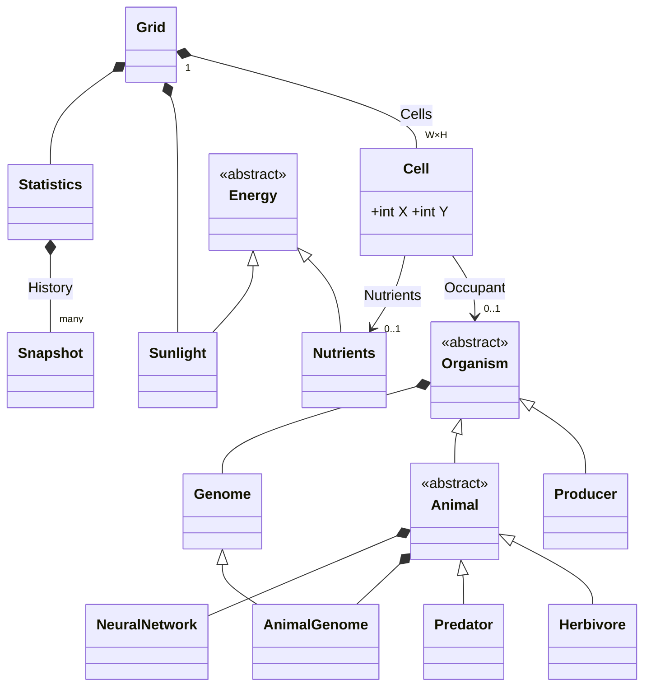

# GameOfLife — programátorská dokumentace

## 1. Přesné zadání (pravidla simulace)

### 1.1 Prostředí
- Mřížka `Config.GridWidth × Config.GridHeight` = **50 × 50** buněk, **pevné okraje**.
- Buňka (`Cell`) nese: souřadnice, nejvýše jednoho `Occupant` (organismus) a libovolně mnoho `Nutrients` (živiny s energií).
- Globální **slunce** (`Sunlight`): jedna hodnota pro celou mřížku v rozsahu 0–`SunlightMaxEnergy` (200), nastavitelná za běhu.
- Čas je diskrétní. Jeden krok = jeden průchod `Grid.Step()`.
- Souřadnice: `Cells[x, y]`; směr `N` je `(0, +1)` atd.

### 1.2 Organismy

Společné vlastnosti (`Organism`): `Energy`, `EnergyMax`, `Age`, `AgeMax`, `AdultAge`, `IsAlive`, `Genome`.

| Druh | Třída | Zdroj energie | Pohyb | Dospělost | Výchozí AgeMax / EnergyMax |
|---|---|---|---|---|---|
| Producent | `Producer : Organism` | slunce + živiny v buňce | ne | 8 kroků | 40 / 1000 |
| Býložravec | `Herbivore : Animal` | producenti (sousední) | ano, NN | 15 kroků | 80 / 2000 |
| Predátor | `Predator : Animal` | býložravci (sousední) | ano, NN | 25 kroků | 150 / 3500 |

Počáteční populace (`Grid.InitializePopulation`): pro každou buňku jeden hod `Rng.NextDouble()`; podle intervalů `producerChance` / `herbivoreChance` / `predatorChance` (výchozí 0,30 / 0,03 / 0,01) se vytvoří organismus s **50 % `EnergyMax`** a náhodným genomem.

### 1.3 Energetický model

Konstanty v `Config`; čtyři z nich (`StepEnergyCost`, `MovementEnergyCost`, `ReproductionEnergyCost`, `PredationEfficiency`) mají za běhu měnitelnou kopii v `RuntimeSettings`.

| Děj | Vzorec | Výchozí hodnota |
|---|---|---|
| Bazální metabolismus (každý krok, všichni) | `−EnergyMax × StepEnergyCost` | 0,0001 → 0,1 z 1000 |
| Fotosyntéza (producent, každý krok) | `+PhotosynthesisEfficiency × Sunlight` | 0,4 × 200 = **80** |
| Vstřebání živin (producent) | `+min(Nutrients, EnergyMax × NutrientAbsorbtionRate)` | až 20 % `EnergyMax` |
| Pohyb (zvíře, jen když se skutečně pohne) | `−EnergyMax × MovementEnergyCost` | 0,0002 |
| Sežrání kořisti | `+prey.Energy × PredationEfficiency` | 0,3 |
| Rozmnožení — podmínka | `Energy ≥ 0,8 × EnergyMax` (zvířata navíc `Age ≥ AdultAge` a partner se stejnou podmínkou) | |
| Rozmnožení — cena | `−EnergyMax × ReproductionEnergyCost` (u zvířat platí **oba** rodiče) | 0,3 |
| Novorozenec | `NewbornEnergyFraction × EnergyMax rodiče` | 0,3 |
| Smrt → živiny | `Nutrients = Energy × DecompositionFraction` | 0,3 |
| Rozklad živin (každý krok) | `× NutrientDecayFactor`; pod `NutrientMinEnergy` (1,0) zmizí | 0,95 |
| Horní mez energie | `Energy` se ořízne na `EnergyMax` | |
| Smrt | `Energy ≤ 0` nebo `Age > AgeMax` | |

**Důsledky výchozích hodnot** (užitečné pro experimenty):
- Producent se ze startu (500) naplní za ~6 kroků a rozmnožuje se prakticky každý druhý krok, dokud má kam. Metabolismus 0,1/krok je zanedbatelný; producenty limituje pouze místo a věk.
- Bazální a pohybové náklady zvířat (0,2 + 0,4 za krok z 2000) jsou také velmi nízké; zvířata umírají hlavně stářím nebo tím, že se nikdy nedostanou k jídlu.
- **Energie se nezachovává**: slunce je každý krok externí vstup, predace a rozklad mají účinnost 0,3 a živiny se ztrácejí 5 % za krok. `Statistics.TotalEnergy` (organismy + živiny) je tedy ukazatel stavu, ne invariant.

### 1.4 Nutrient cyklus
1. `Grid.Step()` narazí na buňku, jejíž `Occupant.IsAlive == false` → do buňky uloží jako nový objekt `new Nutrients(Energy × 0,3)` a tlející organismus odstraní. 
2. Každý krok `Nutrients.Decay()`: `EnergyAmount *= 0,95`; pod 1,0 se objekt zahodí.
3. Producent stojící v buňce s živinami je vstřebává (`Drain`, max. 20 % svého `EnergyMax` za krok). Živiny se nešíří do sousedních buněk; využije je jen producent, který v buňce vyroste (potomek umístěný do ní).
4. Poznámka: sežraná kořist má v okamžiku smrti plnou energii → vydatné živiny. Organismus zemřelý hladem má `Energy ≤ 0` → živiny ≤ 0 → okamžitě zmizí.

### 1.5 Vnímání, neuronová síť a genom

**Vnímání** (`Animal.ScanSurroundings`): "Poloměr" `ScanningRadius` = 4, tj. okno 9×9 bez středu, oříznuté okrajem mřížky. Celé okno se rozdělí do osmi sektorů (cca po 45 stupních) a funkce `ScanByDirection` hledá v každém směru nejbližší relevantní objekt.

**Vstupy NN** (33 hodnot, `BuildNeuralInputs`):

| Index | Význam | Hodnoty |
|---|---|---|
| 0–15 | potrava: pro každý směr `(1 − vzdálenost/4, energie kořisti)` | blízkost 0–1; energie potravy |
| 16–23 | hrozba: vzdálenost nejbližšího predátora v každém směru | 0–1; u predátorů vždy 0 (`MatchesThreat => false`) |
| 24–31 | partner: vzdálenost nejbližšího dospělého partnera s energií ≥ 80 % | 0–1 |
| 32 | vlastní `Energy / EnergyMax` | 0–1 |

**Síť** (`NeuralNetwork.Forward`): složena ze dvou vrstev (33 → 16 → 8), aktivace v obou vrstvách probíhá pomocí funkce `tanh` bez biasů. Váhy jsou jedno pole `double[656]` (`33·16 + 16·8`), uložené v jednom poli za sebou: `weights[j·33 + i]` pro skrytou vrstvu, za nimi `weights[528 + k·16 + l]` pro výstupní. Výstup = 8 hodnot; `argmax` určí směr pohybu. Síť je čistě statická funkce.

**Genom** (`Genome`, `AnimalGenome : Genome`):
- `Genes[]` indexované `GeneIndex`: `AgeMax`, `EnergyMax`, `StepEnergyCost`, (zvířata pak mají navíc:) `MovementEnergyCost`. Producent má 3 geny, zvíře 4 + `Weights[656]`, které se také dědí a mutují.
- Počáteční genom: gauss kolem výchozí hodnoty se σ = `MutationSigma` = 0,05, oříznutý do mezí `<Druh>Min/Max<Gen>`; váhy NN nabývají hodnot ~ N(0, 0,5).
- **Rozmnožení producenta** (`Genome.Mutate`): nepohlavní rozmnožování - potomek vzniká dělením z jednoho rodiče; každý gen se vypočítá z hodnoty rodičovského genu mutací kolem středové hodnoty s normálním rozdělením a směrodatnou odchylkou, následně je ořezán pomocí `Math.Clamp` do rozumných mezí.
- **Rozmnožení zvířat** (`AnimalGenome.Crossover`): každý gen i každá váha = průměr rodičů + gauss(0, σ), geny oříznuty do mezí, váhy do `±WeightBound` (= 2).
- Gaussovský generátor vytvořen pomocí Box–Mullerovy transformace (rovnoměrné --> normální rozdělení) nad `Grid.Rng`.
- Poznámka k σ: mutace je absolutní (σ = 0,05 v jednotkách genu). Pro `AgeMax` (desítky) a `EnergyMax` (tisíce) je to prakticky nulová variabilita; reálná evoluce probíhá jen ve vahách NN (rozsah ±2); v budoucnu by se dal přidat widget na měnění této hodnoty za běhu a mít různé hodnoty pro různé veličiny.

### 1.6 Determinismus a náhoda
- Jediný zdroj náhody v jádře je statický `Grid.Rng`. Uživatel si může nastavit vlastní seed za účelem reprodukovatelnosti experimentů.
- Presety *Náhodný poměr* a *Náhodné životní parametry* používají vlastní neseedovaný `Random` — jejich výsledek se do seedu nepromítá(!); pro protokol experimentu je nutné zapsat vzniklé hodnoty.
- `Grid.Rng` a `RuntimeSettings` jsou `static` → na Blazor Serveru jsou sdílené mezi všemi připojenými prohlížeči. Pro jednoho uživatele to nevadí, pro více současných relací by se mohly ovlivňovat.

## 2. Zvolený algoritmus — krok simulace

`Grid.Step()` je jednoduchý sekvenční průchod, `O(W·H·r²)` kde `r` = poloměr vnímání:

```
pro x = 0..W-1, pro y = 0..H-1:                   (x vnější, y vnitřní)
    occ = Cells[x,y].Occupant
    pokud occ ≠ null a occ není naživu:
        Cells[x,y].Nutrients = Nutrients(o.Energy × 0,3); Occupant = null; pokračuj
    pokud occ je Animal:      potomek = occ.Act(grid, x, y)
        // Act vrací potomka nebo null, nedojde-li k reprodukci
    pokud occ je Producer:    potomek = occ.Act(grid, x, y)
    pokud potomek ≠ null:   umísti do první volné buňky v okolí 5×5 rodiče
                            (prohledává se dx = −2..2, dy = −2..2; když není místo, potomek zaniká)
    pokud v buňce jsou živiny: Decay(); pod 1,0 odstraň
StepNumber++; Statistics.RecordStep()
```

`Animal.Act`:
```
Metabolize()                              – náklady + stárnutí (může zabít)
obs = ScanSurroundings(r = 4)
potrava vedle (Moore 3×3)? → Eat(ta s nejvyšší energií); ate = true
dospělý ∧ Energy ≥ 80 % ∧ partner vedle (dospělý, ≥ 80 %)? → Reproduce(partner)
pokud !ate → Move(): NN → argmax → pokus o přesun; při obsazené/cizí cílové buňce zůstane stát bez nákladů
```

`Producer.Act`: `Metabolize()` → `Photosynthesize(Sunlight)` → `AbsorbNutrients(vlastní buňka)` → při ≥ 80 % `Reproduce()`.

**Artefakty sekvenčního průchodu** (vědomě přijaté zjednodušení):
- Zvíře, které se přesune do buňky s vyšším indexem (`x` větší, nebo stejné `x` a větší `y`), je v témže kroku **navštíveno znovu** a jedná podruhé. Totéž platí pro čerstvě umístěné potomky.
- Sežraná kořist je jen označena `IsAlive = false`; z mřížky zmizí až při návštěvě její buňky (v tomto kroku, pokud leží „před“ predátorem, jinak v příštím). Do té doby blokuje buňku a je viditelná ve `Statistics` a v GUI.
- Kdo je v pořadí dřív, ten jí dřív: při dvou zvířatech u jedné kořisti vyhrává nižší index.

## 3. Diskuse výběru algoritmu
- **Reflexy + NN jen pro pohyb**: jídlo a rozmnožování jsou pevná pravidla, síť rozhoduje pouze o směru. Zjednodušuje to výstup sítě na 8 hodnot a evoluce tak řeší jediný, dobře definovaný problém (kam jít). [DOPLNIT: zvažovaná varianta s výstupy „jíst / rozmnožit se“?]
- **Průměrování + šum místo klasického křížení po genech**: jednoduchá implementace, hladká změna; nevýhodou je, že populace konverguje ke střední hodnotě. [DOPLNIT důvody]
- **Sekvenční průchod místo dvoufázového (plán → aplikace)**: jednodušší, bez kopie mřížky; cena jsou artefakty z kap. 2. [DOPLNIT]
- **Globální slunce místo lokálního světla**: jedna hodnota jde snadno ovládat sliderem a dá vzniknout experimentům typu „zatmění“. [DOPLNIT]
- [DOPLNIT další zavržené varianty]

## 4. Program — struktura

### 4.1 Rozdělení
Simulační jádro (12 souborů) nemá žádnou závislost na Blazoru; GUI (4 komponenty) drží jednu instanci `Grid` a volá `Step()`. Vše je v globálním namespace. Externí knihovny nejsou; graf je ručně generované SVG. Diagram níže zachycuje simulační model. Globální parametry drží statické třídy Config (defaulty) a RuntimeSettings (laditelné za běhu).




### 4.2 Třídy jádra

| Třída | Odpovědnost | Klíčové členy |
|---|---|---|
| `Config` | všechny konstanty (rozměry, energetika, meze genů, rozměry NN, graf) | `const`; jen nutrient parametry jsou `static` (měnitelné, ale GUI je nemění) |
| `RuntimeSettings` | za běhu měnitelné kopie 4 energetických konstant | statické property |
| `Energy` (abstr.) → `Nutrients`, `Sunlight` | nosič energie; živiny umí `Drain`, `Decay`, `IsDepleted`; slunce `UpdateEnergy` s ořezem 0–200 | |
| `Cell` | `Occupant`, `Nutrients`, `X`, `Y` | |
| `Grid` | mřížka, průchod kroku, přesuny, umístění potomků, inicializace populace; drží `Sunlight`, `Statistics` a statický `Rng` | `Step()`, `MoveOrganism()`, `PlaceOffspring()`, `InitializePopulation()`; `PrintStatus()` je ladicí výpis do konzole |
| `Organism` (abstr.) | energie, věk, smrt, metabolismus | `UpdateEnergy()` (ořez shora, smrt při ≤ 0), `UpdateAge()`, `Metabolize()`, `Die()` |
| `Animal : Organism` (abstr.) | vnímání, NN vstupy, pohyb, obecná logika kroku; typované pomocné metody `FindAdjacentFoodType<T>`, `FindAdjacentMateType<T>`, `FindMates<T>` | `Act()`, `Move()`, `ScanSurroundings()`, `ScanByDirection()`, `BuildNeuralInputs()`; vnořené `ObservedCell`, `DirectionalInfo`, `Direction`, `DirectionCoords` |
| `Producer` | fotosyntéza, vstřebávání živin, nepohlavní rozmnožení | `Act()`, `Photosynthesize()`, `AbsorbNutrients()`, `Reproduce()` |
| `Herbivore`, `Predator` | konkretizace `Animal`: co je potrava / hrozba / partner, `Eat`, `Reproduce` s `Crossover` | `Predator` je `internal` (chybí `public`) |
| `Genome`, `AnimalGenome` | geny, náhodné genomy, `Mutate` (producent), `Crossover` (zvířata), `GaussianRNG` | `GeneIndex` enum |
| `NeuralNetwork` | statický `Forward()` | |
| `Statistics` | `record Snapshot` a `History` — po každém kroku počty, součty energií po druzích, celková energie (vč. živin), intenzita slunce 0–1 | `RecordStep()` |


### 4.3 Datové struktury
- Mřížka: `Cell[,]` (2D pole, `[x, y]`). Organismy nemají vlastní seznam — existují jen jako `Occupant` buňky; proto se pozice předává do `Act(grid, x, y)` jako parametry a organismus svou polohu nezná.
- Vnímání: `List<ObservedCell>` (relativní `Dx`, `Dy`, `Occupant`) → `Dictionary<Direction, DirectionalInfo>` (nejbližší kandidát na směr).
- Genom: `double[] Genes` + u zvířat `double[] Weights` (656).
- Statistika: `List<Snapshot>` neomezeně rostoucí po celý běh (žádný ořez historie).

### 4.4 Tok dat mezi simulací a GUI (`SimulationPage.razor`)
- `@rendermode InteractiveServer`; komponenta drží `Grid? grid`.
- Běh: `Start()` vytvoří `PeriodicTimer(1000 / stepsPerSec ms)` a ve smyčce `await WaitForNextTickAsync()` → `lock (safetyLock) { grid.Step(); }` → `InvokeAsync(StateHasChanged)`. `Stop()` timer `Dispose()`ne, čímž smyčka skončí. Změna rychlosti timer restartuje.
- Všechny zásahy z GUI (krok, reset, slunce, změna `RuntimeSettings`) jsou pod stejným `safetyLock`, takže UI nikdy nečte rozpracovaný stav.
- `Reset()`: `Stop()` → `Grid.Rng = new Random(seed)` → `OnInitialized()` (nový `Grid` + `InitializePopulation` s aktuálními pravděpodobnostmi).
- Vykreslení mřížky: CSS grid z **2 500 `<div>`** (třída podle obsahu: `producer` / `herbivore` / `predator` / `nutrient-high|medium|low`), v obsazených buňkách `` s ikonou. Každý krok se tedy přenáší diff celého DOM přes SignalR — to je hlavní výkonnostní limit (max. 15 kroků/s v GUI).
- Graf: komponenta `Chart` dostává `History` a přepínače, generuje `<polyline>` v SVG 500×300 (`Config.GraphWidth/Height`). Počty sdílejí jedno měřítko (max ze všech tří druhů), energie jiné (max `TotalEnergy`), slunce 0–1; volitelně `log10(v + 1)`.
- `Fullscreen` volá JS funkci `toggleFullscreen` (definovaná v [DOPLNIT: soubor]).
- Komponenty `InitControls.razor` a `RuntimeControls.razor` jsou **nepoužité** — jejich obsah je vložen přímo v `SimulationPage.razor`. Totéž metody `ChangeProducerChance` a spol.


## 5. Alternativní programová řešení
- **Blazor Server** vs. WebAssembly vs. konzole: server drží simulaci v C# na jednom místě, ladí se snadno, nevyžaduje JS; daň je přenos DOM diffu každý krok a sdílený statický stav. [DOPLNIT důvody, vliv Termuxu]
- **Vykreslení**: divy + ikony vs. `<canvas>` přes JS interop vs. SVG. Divy jsou nejjednodušší a dostačují pro 50×50. [DOPLNIT]
- **Instance vs. statika** pro `Rng` a `RuntimeSettings`: statika zjednodušila předávání do genomu a organismů, ale brání více nezávislým simulacím. [DOPLNIT]
- [DOPLNIT další]

## 6. Průběh prací
[DOPLNIT — chronologicky a poctivě: co šlo snadno, co ne, specifika vývoje na tabletu v Termuxu (SDK, editor, ladění, hot reload), slepé uličky. Stopy v kódu: nepoužité `InitControls`/`RuntimeControls` naznačují původní záměr rozdělit panel na komponenty; `PrintStatus` na konzolové ladění před GUI.]

## 7. Experimenty a ladění

Protokoly jsou v `docs/experimenty/`, jeden soubor na experiment, šablona:

```
# Experiment NN — název
Datum / commit:
Seed:                      (a poznámka, že byl stisknut Reset)
Inicializace:              producenti / býložravci / predátoři (pravděpodobnosti)
Životní parametry:         predace / reprodukce / pohyb / metabolismus (skutečné hodnoty, i po „Náhodné“)
Slunce:                    hodnota a případné změny během běhu (v kterém kroku)
Hypotéza / co sleduji:
Průběh:                    délka, klíčové okamžiky (kolaps, oscilace, vymření druhu)
Pozorování:                + screenshot grafu
Závěr / změna kódu nebo parametrů:
```

Přehled:

| # | Seed | Co se ladilo | Výsledek |
|---|---|---|---|
| [DOPLNIT] | | | |

Náměty vyplývající z kódu: (a) vliv slunce — při jakém jasu producenti přestanou stíhat rozmnožování; (b) `PredationEfficiency` 0,3 vs. vyšší — kdy býložravci vyhladí producenty; (c) preset *Přemnožení predátorů* (0,2/0,05/0,02); (d) evoluce vah — porovnat průměrnou energii býložravců na začátku a po N krocích při stejném seedu.

## 8. Co nebylo dodělané / známé nedostatky
- Geny `StepEnergyCost` a `MovementEnergyCost` jsou dědičné, ale nepoužité (`Metabolize`/`Move` čtou `RuntimeSettings`). Zamýšlené: individuální náklady na jedince.
- Mutace se σ v absolutních jednotkách → `AgeMax`/`EnergyMax` se prakticky nevyvíjejí; přirozený krok je relativní σ (procento hodnoty).
- Vstup NN „energie potravy“ není normalizovaný (rozsah do ~1500), zatímco ostatní vstupy jsou 0–1 → po `tanh` tato složka saturuje.
- Sekvenční průchod: dvojí akce po pohybu „dopředu“, mrtvoly blokující buňky (kap. 2).
- Živiny se při nové smrti v buňce přepisují, nesčítají.
- `Grid.Rng` bez seedu při prvním načtení; statický stav sdílený mezi relacemi.
- `Statistics.History` roste bez omezení; GUI překresluje 2 500 divů každý krok.
- Nepoužitý kód: `InitControls.razor`, `RuntimeControls.razor`, `NeuralNetwork` instanční část, `Config.DaysToFullEnergy`, `Grid.PrintStatus`, `Animal.FindMates`.
- Chybí hlavičky souborů a jednotkové testy.
- [DOPLNIT: co bylo plánováno a není]

## 9. Možná rozšíření
- Zapojit geny nákladů do `Metabolize`/`Move`; relativní σ mutace; normalizace vstupů NN, biasy.
- Dvoufázový krok (rozhodnutí → aplikace) nebo náhodné pořadí buněk.
- Výstupy NN pro „jíst / rozmnožit se / zůstat stát“, paměť (rekurentní vstup).
- Šíření živin do okolí, lokální světlo (stín), toroidní mřížka.
- Export `History` do CSV, uložení/načtení stavu a genomů, zobrazení „nejlepšího“ genomu.
- Canvas rendering, ořez historie, instance místo statiky (více simulací vedle sebe).
- [DOPLNIT]

## 10. Sada testovacích příkladů
Automatické testy nejsou. Ruční scénáře, u nichž je správný výsledek předem znám:

| Scénář (nastavení + Reset) | Očekávání |
|---|---|
| 0 / 0 / 0 | prázdná mřížka, `Step` nic nemění, počty 0 |
| jen producenti (0,3 / 0 / 0) | rostou do zaplnění, křivka se ustálí na hodnotě dané věkem 20–60 a místem |
| jen býložravci (0 / 0,05 / 0) | bez potravy; při výchozích nákladech je energie na hlad nestačí zabít, vymřou stářím nejpozději do 120 kroků |
| slunce 0, jen producenti | žádná fotosyntéza; producenti vymřou stářím, živiny zmizí |
| stejný seed + stejné hodnoty, dvakrát Reset | identické křivky |
| `PredationEfficiency` = 0 | zvířata nikdy nezískají energii z kořisti, ale kořist stále zabíjejí |
| [DOPLNIT] | |

## 11. Závěrečný povzdech
[DOPLNIT]
